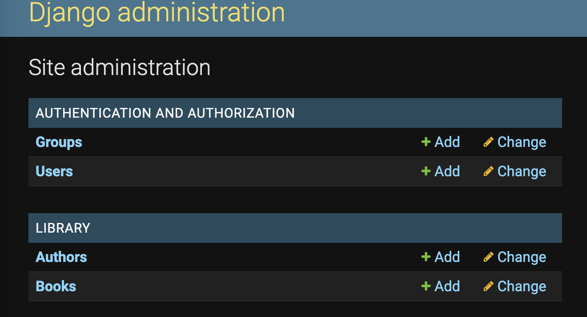
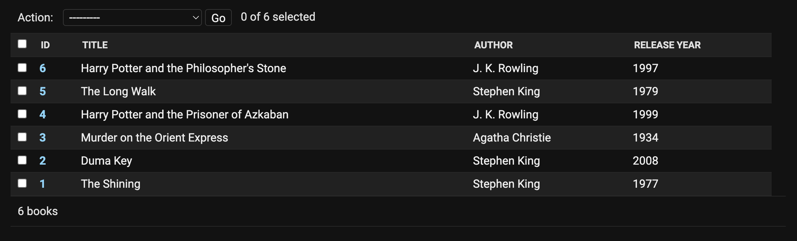
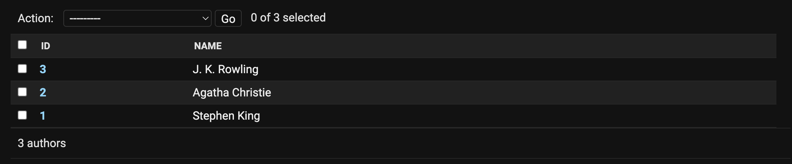
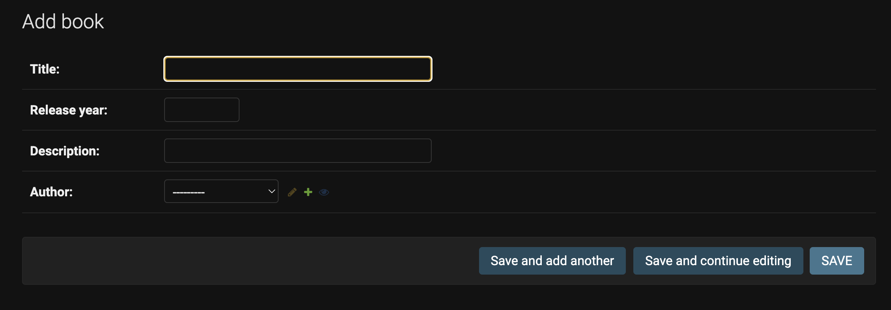

<h1 align="center">BOOKLIB</h1>

## Description
<p align="center">

Library of books. You can add one author to whom several books are linked. Or add a book with information about the author, year of publication or a brief description.

<p align="center">









</p>

### About the project.
The project is completely done with Django, HTML and CSS. SQLite was used as a database.

## Project setup

```
On Mac
python3 manage.py runserver

Windows
python manage.py runserver
```